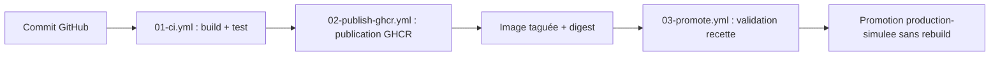

# 02 - Schéma de la chaîne CICD

## Schéma logique

## Explication

**01-ci.yml** : Déclenché automatiquement à chaque push sur main. Construit l'image Docker depuis le Dockerfile, lance un conteneur de test, vérifie que le site répond avec un code HTTP 200, contrôle la présence de "Catal-Log" dans le HTML et valide le fichier version.json. Si un test échoue, le pipeline s'arrête.

**02-publish-ghcr.yml** : Déclenché après le CI. Se connecte à GHCR via le GITHUB_TOKEN, construit et publie l'image avec trois tags : sha court (sha-xxxxxxx), latest et 1.0.0. Le digest sha256 est enregistré et affiché dans les logs.

**03-promote.yml** : Déclenché manuellement via workflow_dispatch. L'opérateur saisit le tag SHA à promouvoir. Le workflow valide l'image en environnement recette (test HTTP), puis après approbation manuelle, re-tag l'image en production sans aucun rebuild.

## Orchestration légère

Le fichier compose.yml décrit un service web Nginx et un second service whoami. Il sert à documenter et simuler une coordination de conteneurs, sans prétendre remplacer une orchestration de production. Les deux services partagent un réseau bridge interne nommé catal-log-network.

## Limite importante

Docker Compose est utile pour une mise en situation, un test local ou une démonstration de coordination. En production réelle, il faudrait traiter d'autres sujets : haute disponibilité, répartition de charge, supervision, politique de déploiement, rollback, sécurité, sauvegarde et restauration. Docker Compose est mono-hôte et ne gère pas le self-healing contrairement à Kubernetes.
